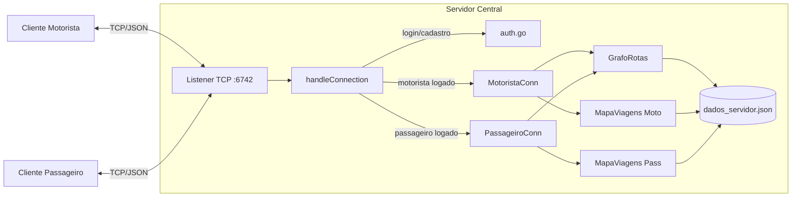

# VaiJunto, Sistema de Caronas Compartilhadas

Servidor central e clientes (motorista e passageiro) para um sistema de caronas
compartilhadas de média/longa distância, desenvolvido em **Go**, com comunicação
via **sockets TCP nativos** (sem frameworks de RPC/mensageria) e serialização em
**JSON**. Trabalho da disciplina TEC502, Problema 1 (VaiJunto).

---

## Sumário

1. [Arquitetura](#1-arquitetura)
2. [Comunicação](#2-comunicação)
3. [Protocolo (API Remota)](#3-protocolo-api-remota)
4. [Encapsulamento](#4-encapsulamento)
5. [Busca de Itinerários](#5-busca-de-itinerários)
6. [Concorrência](#6-concorrência)
7. [Atomicidade da Reserva](#7-atomicidade-da-reserva)
8. [Interação (Clientes)](#8-interação-clientes)
9. [Confiabilidade](#9-confiabilidade)
10. [Testes](#10-testes)
11. [Emulação (Docker)](#11-emulação-docker)
12. [Como executar](#12-como-executar)
13. [Limitações conhecidas / Próximos passos](#13-limitações-conhecidas--próximos-passos)

---

## 1. Arquitetura

O sistema é composto por três executáveis independentes, todos em Go:

| Componente | Arquivo(s) | Papel |
|---|---|---|
| **Servidor central** | `servidor.go`, `auth.go`, `banco.go`, `grafo.go`, `Usuario.go`, `Viagem.go`, `motoristaConn.go`, `passageiroConn.go` | Mantém todo o estado do sistema: usuários, caronas, reservas e o grafo de rotas. |
| **Cliente Motorista** | `motorista.go` | CLI para publicar/remover/listar caronas. |
| **Cliente Passageiro** | `passageiro.go` | CLI para buscar, reservar, listar e remover reservas. |
| **Pacote compartilhado** | `modelos.go` (pacote `shared`) | Define o protocolo (`Request`/`Resposta`), o enum de cidades e funções utilitárias de impressão/leitura usadas pelos clientes. |

O servidor guarda o estado em estruturas globais (`servidor.go`):

- `Motoristas`, `Passageiros` (`sync.Map`), cadastro de usuários por nome.
- `grafo` (`*GrafoRotas`), grafo de trechos disponíveis, usado na busca de itinerários.
- `ViagensMoto`, `ViagensPass` (`*MapaViagens`), caronas publicadas por motorista e reservas feitas por passageiro, indexadas por `usuário → ID da viagem → *Viagem`.

Modelo de dados (`Viagem.go`, `Usuario.go`):

- **Usuario**: nome, senha, flag `LoggedIn` e lista de notificações.
- **Viagem**: representa tanto uma *carona publicada* (dono = motorista) quanto uma *reserva* (dono = passageiro); é composta por uma lista ordenada de `Trecho`.
- **Trecho**: menor unidade controlável de vaga, origem, destino, quantidade de `Vagas`, preço e a lista de reservas (`ReservasAssociadasIDS`) que consomem aquele trecho. Uma carona com N cidades gera N‑1 trechos independentes, permitindo embarque/desembarque em qualquer par de cidades da rota.



---

## 2. Comunicação

- A comunicação usa a **API de sockets nativa do TCP/IP** (`net.Listen` / `net.Dial`), sem nenhuma biblioteca de RPC ou mensageria, conforme exigido pelo enunciado.
- O servidor escuta em `0.0.0.0:6742` (`servidor.go`). Para cada conexão aceita, uma goroutine dedicada é disparada (`go handleConnection(conn)`), permitindo atendimento simultâneo de múltiplos clientes sem bloqueio.
- Sobre a mesma conexão TCP é aberto um `json.Encoder`/`json.Decoder` (`encoding/json`), que fazem streaming de objetos JSON, não é necessário framing manual porque o decoder do Go já sabe onde cada objeto termina.
- **TCP** foi escolhido (em vez de UDP) porque o protocolo exige entrega **confiável e ordenada**: uma reserva depende de um fluxo de requisição/resposta em sequência (ex.: buscar rota → confirmar/pular/cancelar) e a perda ou reordenação de uma mensagem corromperia o estado da negociação.
- Ciclo de vida da conexão:
  1. `handleConnection` trata as ações "públicas" (`CADASTRO_MOTORISTA`, `LOGIN_MOTORISTA`, `CADASTRO_PASSAGEIRO`, `LOGIN_PASSAGEIRO`, `DESCONECTAR`).
  2. Após um login/cadastro bem-sucedido, o controle é passado para `MotoristaConn` ou `PassageiroConn`, que entram em loop de leitura/escrita dedicado ao usuário autenticado.
  3. A saída ocorre por `LOG_OUT` explícito, por erro de decodificação (`io.EOF` ou conexão quebrada) ou por `DESCONECTAR` antes do login.

---

## 3. Protocolo (API Remota)

O protocolo é definido em `modelos.go` (pacote `shared`) por dois envelopes únicos:

```go
type Request struct {
    Acao    string       `json:"acao"`
    ID      string       `json:"id,omitempty"`
    Nome    string       `json:"nome,omitempty"`
    Senha   string       `json:"senha,omitempty"`
    Origem  string       `json:"origem,omitempty"`
    Destino string       `json:"destino,omitempty"`
    Trechos []TrechoData `json:"trechos,omitempty"`
}

type Resposta struct {
    Status  string       `json:"status"`             // SUCESSO | FALHA | ERRO
    Message string       `json:"message"`
    Dados   []string     `json:"dados,omitempty"`    // ex.: notificações
    Viagens []ViagemData `json:"trechos,omitempty"`  // ex.: itinerários/reservas
}
```

O campo `acao` funciona como o "código de operação" da API. Todas as trocas são requisição→resposta (síncronas), exceto o fluxo de busca de itinerário, que é uma pequena negociação de múltiplas mensagens.

### Ações disponíveis

| Fase | Ação | Quem envia | Efeito |
|---|---|---|---|
| Pré-login | `CADASTRO_MOTORISTA` / `CADASTRO_PASSAGEIRO` | Motorista/Passageiro | Cria usuário e já efetua login |
| Pré-login | `LOGIN_MOTORISTA` / `LOGIN_PASSAGEIRO` | Motorista/Passageiro | Autentica |
| Pré-login | `DESCONECTAR` | Ambos | Encerra a conexão TCP |
| Motorista | `CADASTRAR_ROTA` | Motorista | Publica uma carona (`Trechos: []TrechoData`) |
| Motorista | `REMOVER_VIAGEM` | Motorista | Cancela uma carona e todas as reservas dependentes |
| Motorista | `LISTAR_ROTAS` | Motorista | Lista caronas publicadas e passageiros por trecho |
| Passageiro | `BUSCAR_E_RESERVAR` | Passageiro | Inicia a busca de itinerário (ver fluxo abaixo) |
| Passageiro | `CONFIRMAR_ROTA` / `PROXIMA_ROTA` / `CANCELAR` | Passageiro | Respostas dentro do fluxo de busca |
| Passageiro | `REMOVER_RESERVA` | Passageiro | Cancela uma reserva e libera as vagas |
| Passageiro | `LISTAR_RESERVAS` | Passageiro | Lista reservas do passageiro |
| Passageiro | `GET_NOTI` | Passageiro | Consulta notificações (ex.: cancelamentos de motorista) |
| Ambos | `LOG_OUT` | Ambos | Efetua logout, mantendo a conexão TCP para retornar ao menu inicial |

### Exemplo, cadastro de motorista

```json
// Requisição
{"acao":"CADASTRO_MOTORISTA","nome":"joao","senha":"123"}

// Resposta
{"status":"SUCESSO","message":"Cadastro concluido"}
```

### Exemplo, fluxo de busca e reserva (múltiplas mensagens)

```json
// 1) Passageiro pede origem/destino
{"acao":"BUSCAR_E_RESERVAR","origem":"Salvador","destino":"Vitória da Conquista"}

// 2) Servidor pré-reserva o primeiro itinerário encontrado e o envia
{"status":"SUCESSO","message":"Busca de rota realizada com sucesso","trechos":[{"ID":"...","Dono":"","Trechos":[...]}]}

// 3) Passageiro confirma
{"acao":"CONFIRMAR_ROTA"}

// 4) Servidor confirma definitivamente
{"status":"SUCESSO","message":"Itinerário reservado com sucesso!"}
```

Caso o passageiro responda `PROXIMA_ROTA`, o servidor libera as vagas do itinerário atual e envia o próximo candidato encontrado pela busca; `CANCELAR` libera as vagas e encerra a negociação.

---

## 4. Encapsulamento

- Toda a comunicação é serializada em **JSON** via `encoding/json`, garantindo interoperabilidade entre implementações de clientes/servidor em linguagens diferentes (desde que sigam o mesmo esquema de campos).
- As *structs* de domínio (`Viagem`, `Trecho`, `Usuario`) não trafegam diretamente na rede: existem tipos de transporte dedicados (`TrechoData`, `ViagemData`) e funções de conversão explícitas (`ToTrechoData`, `ToTrecho`, `ToViagemData`, `TrechoDataSliceToViagem`) em `Viagem.go`, isolando o modelo interno (com mutexes, por exemplo) do formato trafegado.
- Tags `json:"campo,omitempty"` reduzem o tamanho do payload, omitindo campos não utilizados por cada tipo de requisição/resposta.
- **Validação/parsing**: o `json.Decoder` já rejeita mensagens malformadas, retornando um erro de decodificação que hoje faz o servidor **encerrar a conexão** (não há, por ora, uma resposta de erro estruturada de volta ao cliente nesse caso específico, ver seção [13](#13-limitações-conhecidas--próximos-passos)). Já a validação de conteúdo (ex.: campos obrigatórios vazios, ação desconhecida) é feita manualmente em `auth.go`, `motoristaConn.go` e `passageiroConn.go`, retornando `Resposta{Status:"ERRO", ...}`.

---

## 5. Busca de Itinerários

Implementada em `grafo.go` com uma estrutura de **grafo direcionado**:

```go
type GrafoRotas struct {
    Adjacencias map[string][]*Trecho // cidade de origem -> trechos que partem dela
    mu          sync.RWMutex
}
```

- Cada `Trecho` publicado por um motorista vira uma aresta `Origem → Destino` (`AdicionarViagem`).
- A busca (`BuscarRotas`) roda uma **busca em profundidade (DFS) recursiva** (`dfsBusca`) a partir da cidade de origem, explorando todos os caminhos possíveis até a cidade de destino:
  - Mantém um conjunto de `visitados` para evitar ciclos (cidade não pode ser reutilizada no mesmo itinerário, mas pode reaparecer em outra ramificação).
  - Só segue por um trecho se ele tiver `Vagas > 0` no momento da exploração.
  - Ao atingir o destino, copia o caminho corrente para a lista de resultados, isso permite que um itinerário combine trechos de **motoristas diferentes** (ex.: Salvador→Feira de Santana com o motorista A e Feira de Santana→Vitória da Conquista com o motorista B), atendendo diretamente ao cenário descrito no enunciado.
  - O critério de ordenação das opções apresentadas ao passageiro é a **ordem de descoberta da DFS** (não há, hoje, ordenação por preço ou número de trechos, ver seção 13).
- O consumo dos resultados é feito de forma **incremental** por `loopEscolhareserva` (`passageiroConn.go`): a cada itinerário candidato, o servidor tenta reservá-lo provisoriamente (seção 7) e só então o envia ao cliente, evitando mostrar ao passageiro opções que já não têm mais vaga.

---

## 6. Concorrência

O servidor atende **múltiplos clientes simultaneamente**, cada um em sua própria goroutine, e protege as estruturas compartilhadas em diferentes granularidades:

| Estrutura | Mecanismo | Motivo |
|---|---|---|
| `Motoristas`, `Passageiros` (cadastro de usuários) | `sync.Map` | Múltiplos logins/cadastros concorrentes sem trava manual |
| `Usuario` (flag `LoggedIn`, notificações) | `sync.Mutex` por usuário | Evita, por exemplo, duas conexões simultâneas alterando `LoggedIn` do mesmo usuário |
| `GrafoRotas.Adjacencias` | `sync.RWMutex` | Leitura concorrente livre durante buscas (`RLock`), escrita exclusiva ao publicar/remover carona (`Lock`) |
| `MapaViagens` (caronas e reservas por usuário) | `sync.Mutex` | Protege o mapa `usuário → ID → *Viagem` contra leitura/escrita concorrente |
| `Trecho` (vagas e lista de reservas associadas) | `sync.Mutex` por trecho | Menor granularidade de trava, permite que trechos diferentes sejam reservados em paralelo sem se bloquearem |

O modelo é **thread-per-connection** (uma goroutine por cliente conectado), adequado à escala esperada em laboratório/demonstração; a concorrência real de acesso aos dados é resolvida pelas travas acima, não pelo modelo de conexão.

---

## 7. Atomicidade da Reserva

A atomicidade multi-trecho é o ponto mais sensível do sistema e está concentrada em `GrafoRotas.TentarReservarItinerario` (`grafo.go`):

1. **Ordenação determinística dos trechos** pelo campo `ID` antes de travar qualquer um deles. Isso garante que, não importa em qual ordem dois passageiros concorrentes tentem reservar itinerários que compartilham trechos, ambos adquirem as travas na **mesma ordem global**, eliminando a possibilidade de *deadlock* circular (clássico problema de "lock ordering").
2. **Lock de todos os trechos do itinerário** antes de qualquer verificação.
3. **Checagem de vagas em todos os trechos** só então: se **qualquer** trecho estiver sem vaga, a função retorna `false` sem decrementar nada, nenhuma reserva parcial é criada.
4. Se todos tiverem vaga, o itinerário recebe um `ID` (`uuid`), e **todas as vagas são decrementadas atomicamente** dentro da mesma seção crítica, com o par `{ID da viagem, usuário}` anotado em cada trecho (`ReservasAssociadasIDS`), isso é o que permite, depois, rastrear e cancelar em cascata (item 9).
5. Todas as travas são liberadas via `defer` ao final da função, mesmo em caminhos de erro.

Sobre a **corrida entre consulta e confirmação**: como a reserva de vagas já ocorre no momento em que o servidor *encontra* o itinerário (antes de enviá-lo ao cliente, ver `loopEscolhareserva`), o primeiro passageiro a chegar até aquele ponto do código garante as vagas; os demais, ao consultar depois, simplesmente não encontram mais vaga naquele trecho e recebem outras combinações (ou nenhuma). Se o passageiro não confirmar (`PROXIMA_ROTA` ou `CANCELAR`), `GrafoRotas.LiberarVagas` devolve as vagas e remove o par `{ID, user}` da lista de reservas do trecho, também sob a mesma disciplina de lock ordenado.

**Cancelamento em cascata**: quando um motorista remove uma carona (`REMOVER_VIAGEM`), `RemoverViagemMotorista` retorna todos os pares `{ID da reserva, passageiro}` afetados; o servidor então cancela essas reservas nos mapas de passageiros e dispara uma notificação para cada um (`motoristaConn.go`).

---

## 8. Interação (Clientes)

Ambos os clientes (`motorista.go`, `passageiro.go`) são CLIs de terminal orientadas a menu, construídas com `bufio.Scanner` para entrada e o par `json.Encoder`/`json.Decoder` sobre a mesma conexão TCP usada pelo servidor.

**Cliente Motorista**
- Menu inicial: login, novo cadastro, encerrar.
- Menu autenticado: cadastrar rota (escolhe sequência de cidades via `ConstruirRota`, depois define preço e vagas por trecho via `DefinirVagasTrechos`), remover rota (lista e escolhe por índice), listar rotas (mostra, por trecho, os passageiros confirmados), logout.

**Cliente Passageiro**
- Menu inicial: login, novo cadastro, encerrar.
- Menu autenticado: buscar rota (informa origem/destino e navega pelas opções retornadas com confirmar/próxima/cancelar), remover reserva, listar reservas, ver notificações, logout.

As funções de impressão (`ImprimirViagens`, `ImprimirReservas`, `ImprimirNotificacoes`, `ImprimirCidades`) e leitura validada (`LerInt`, `LerFloat`, com suporte a cancelamento digitando `c`) ficam centralizadas em `modelos.go` para reuso entre os dois clientes.

---

## 9. Confiabilidade

- **Persistência periódica**: uma goroutine no servidor (`servidor.go`) chama `Salvar()` a cada 10 segundos, serializando motoristas, passageiros e os mapas de viagens/reservas em `dados/dados_servidor.json` (`banco.go`). Na inicialização, `Carregar()` reconstrói esse estado **e o grafo de rotas** a partir do arquivo, e reseta `LoggedIn = false` para todos os usuários (evita que uma queda do servidor deixe contas presas como "logadas").
- **Log**: `ConfigurarLogs()` grava simultaneamente em `stdout` e em `dados/servidor.log`, com timestamp, cobrindo cadastros, logins, publicações/remoções de carona, reservas e erros de conexão.
- **Cliente encerrado abruptamente durante uma negociação de reserva**: como a vaga já foi provisoriamente decrementada antes do envio ao cliente, uma falha na leitura da resposta do passageiro (`decoder.Decode` retorna erro) é tratada explicitamente em `loopEscolhareserva`, chamando `grafo.LiberarVagas(i)` antes de encerrar, evitando vaga perdida.
- **Cliente desconectado sem logout explícito** (fora do fluxo de reserva): a conexão é encerrada ao detectar `io.EOF`/erro de leitura, mas a flag `LoggedIn` do usuário só é zerada no caminho de `LOG_OUT` explícito, ou seja, hoje uma queda abrupta fora do fluxo de reserva deixa `LoggedIn = true` até o próximo restart/`Carregar()`. Está documentado como limitação conhecida (seção 13).
- **Timeouts de socket**: ainda não há uso de `SetDeadline`/`SetReadDeadline` nas conexões, listado como melhoria pendente.

---

## 10. Emulação (Docker)

Os três componentes, servidor, cliente motorista e cliente passageiro, são
containerizados individualmente, um `Dockerfile` por componente
(`Dockerfile.servidor`, `Dockerfile.motorista`, `Dockerfile.passageiro`), permitindo
subir quantas instâncias de cliente forem necessárias em máquinas distintas do
laboratório, cada uma com sua própria imagem.

### Layout de build esperado

Os Dockerfiles assumem que o repositório está organizado como um módulo Go com o
código compartilhado isolado do código de cada executável:

```
.
├── go.mod
├── go.sum
├── shared/              # pacote "shared" (modelos.go: Request/Resposta/TrechoData/...)
└── cmd/
    ├── servidor/        # main do servidor (servidor.go, auth.go, banco.go, grafo.go, ...)
    ├── motorista/        # main do cliente motorista (motorista.go)
    └── passageiro/       # main do cliente passageiro (passageiro.go)
```

Compartilhar o pacote `shared`, permite que cada `Dockerfile` copie apenas o que o seu binário
precisa (menor superfície e imagens mais enxutas).

### Build multi-stage

Cada Dockerfile segue o mesmo padrão de **build em duas etapas**:

1. **Estágio `builder`** (`golang:1.27-alpine`): copia `go.mod`/`go.sum`, o pacote
   `shared/` e o diretório `cmd/<componente>/` daquele executável, e compila um
   binário estático (`go build -o <componente>_bin ./cmd/<componente>/`).
2. **Estágio final** (`alpine:latest`): imagem mínima de runtime, sem toolchain do
   Go, contendo apenas o binário copiado do estágio anterior (`COPY --from=builder`).

Essa separação mantém as imagens finais pequenas.

A imagem do servidor expõe a porta `6742` (`EXPOSE 6742`), a mesma usada pelo
`net.Listen("tcp", "0.0.0.0:6742")` em `servidor.go`. As imagens de cliente não
expõem porta (são apenas TCP *dial-out*) e dependem da variável de ambiente
`endereco`, para saber a quem se conectar, que é o mecanismo usado para resolver a conectividade
entre containers em **máquinas distintas** (próxima seção).

### Build e execução local

```bash
# a partir da raiz do repositório
docker build -f Dockerfile.servidor   -t vaijunto-servidor   .
docker build -f Dockerfile.motorista  -t vaijunto-motorista  .
docker build -f Dockerfile.passageiro -t vaijunto-passageiro .

# sobe o servidor, publicando a porta do container na porta do host
docker run -d --name servidor -p 6742:6742 vaijunto-servidor

# cliente na mesma máquina, apontando para o host
docker run -it --rm -e endereco=host.docker.internal:6742 vaijunto-motorista
```

### Execução em máquinas distintas (cenário do laboratório)

O enunciado pede que servidor e clientes rodem em **computadores diferentes** do
LARSID/LADICA, para uma emulação realista de rede. A conectividade é resolvida
no nível de **rede do host**:

1. **Na máquina do servidor**, a porta do container é publicada diretamente na
   interface de rede do host:
   ```bash
   docker run -d --name servidor -p 6742:6742 vaijunto-servidor
   ```
   A partir daí, `6742` fica acessível em qualquer IP da máquina hospedeira na
   rede do laboratório (modo *bridge* padrão do Docker + *port publishing*).

2. **Em cada máquina cliente**, o container recebe o **IP (ou hostname) da
   máquina do servidor** na rede local via a variável `endereco`:
   ```bash
   docker run -it --rm -e endereco=<IP_DA_MAQUINA_SERVIDOR>:6742 vaijunto-motorista
   docker run -it --rm -e endereco=<IP_DA_MAQUINA_SERVIDOR>:6742 vaijunto-passageiro
   ```

Ou seja, o container do servidor não precisa saber nada sobre os clientes (é ele
quem escuta e aceita conexões); já os clientes só precisam do endereço IP:porta
do host onde o servidor foi publicado.

## 11. Como executar

Pré-requisito: Go instalado, executando a partir da raiz do módulo (`go.mod`),
onde vivem `shared/` e `cmd/{servidor,motorista,passageiro}/`.

```bash
# Servidor (cria dados/ automaticamente ao salvar)
go run ./cmd/servidor

# Cliente motorista (em outro terminal/host)
endereco=127.0.0.1:6742 go run ./cmd/motorista

# Cliente passageiro (em outro terminal/host)
endereco=127.0.0.1:6742 go run ./cmd/passageiro
```

Alternativamente, com os `Dockerfile`s (ver seção 11):

```bash
docker build -f Dockerfile.servidor   -t vaijunto-servidor   .
docker build -f Dockerfile.motorista  -t vaijunto-motorista  .
docker build -f Dockerfile.passageiro -t vaijunto-passageiro .

docker run -d --name servidor -p 6742:6742 vaijunto-servidor
docker run -it --rm -e endereco=<IP_DO_SERVIDOR>:6742 vaijunto-motorista
docker run -it --rm -e endereco=<IP_DO_SERVIDOR>:6742 vaijunto-passageiro
```

As cidades suportadas hoje (enum `Cidade` em `modelos.go`) são: Feira de Santana, Salvador, Simões Filho, Xique-Xique, Vitória da Conquista, Camaçari, Juazeiro, Itabuna, Ilhéus, Porto Seguro e Barreiras.

